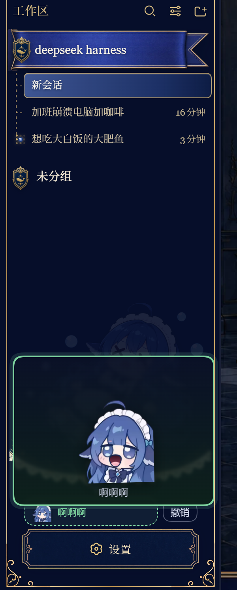
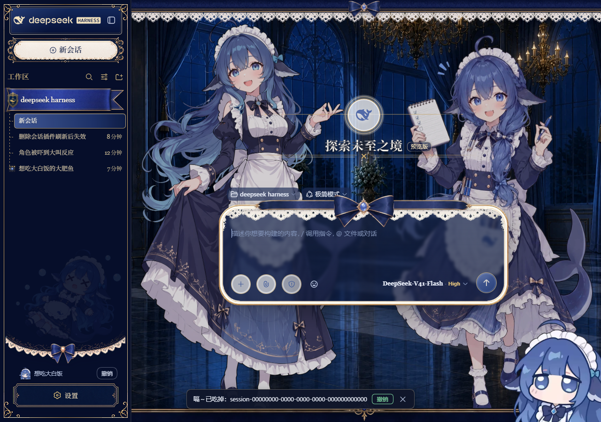
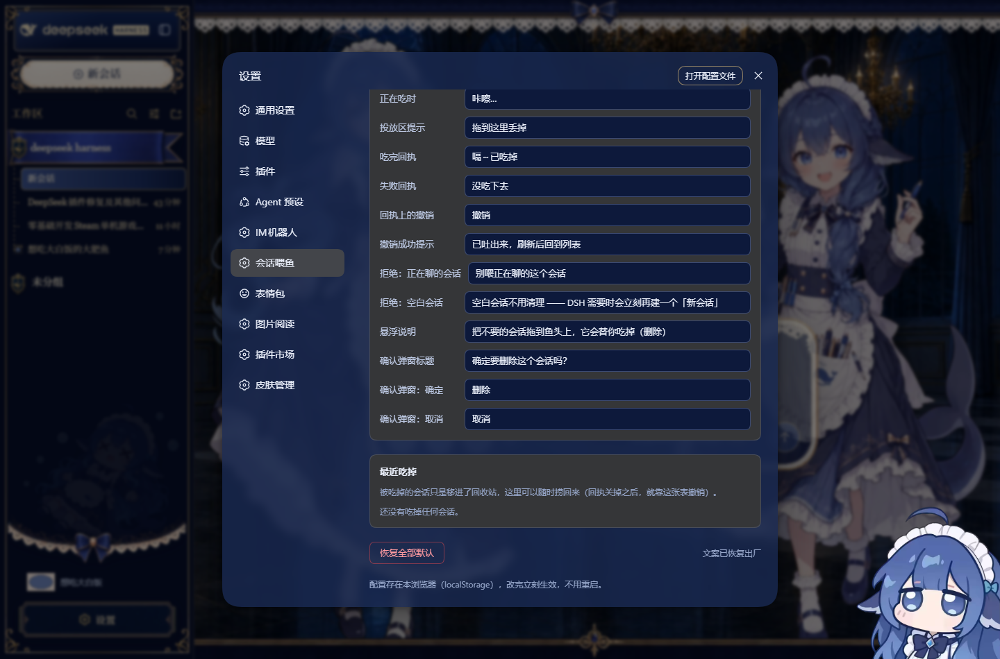
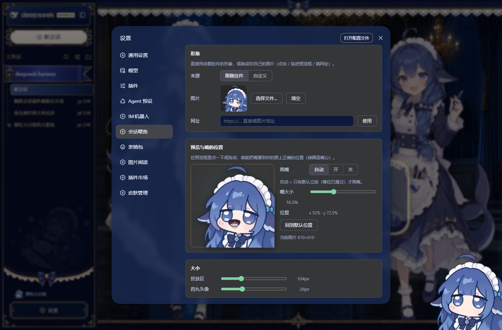
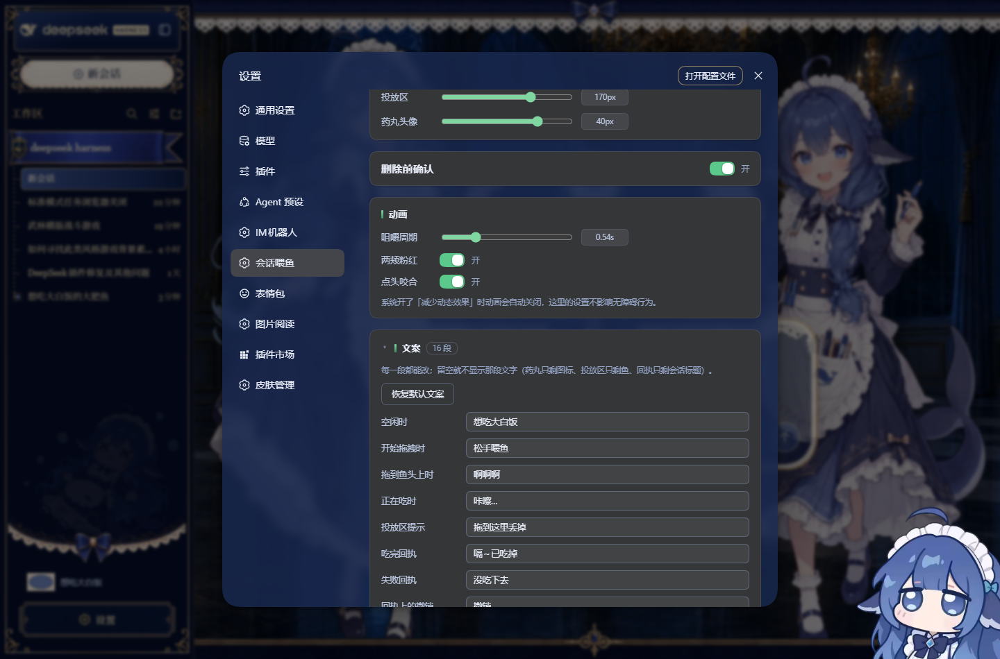

# dsh-session-eater 🐟 会话喂鱼

用**余额小胖鱼挂件**的形象，在左侧会话列表底下当一只垃圾桶：**把不要的会话拖到鱼头上，
它就张嘴吃掉（删除这个对话）**。拖近时张嘴、咀嚼、腮帮子一鼓一鼓，松手后给一条可撤销的回执。



---

## 怎么用

1. 侧边栏最底部（「设置」上面）有一条 **🐟 想吃大白饭** 药丸，**右侧贴着同行的撤销按钮**。
   文案都能改，见下面的「设置 → 文案」。
2. 抓住任意一条会话行往它那边拖 —— 会话列表下缘会展开一大块虚线投放区（默认写着"拖到这里丢掉"）。
3. 拖到鱼头上：**它张开嘴开始啃**（投放区变绿实线，文案变"啊啊啊"）。
4. 松手 —— 会话被吃掉，列表里那一行立刻消失，底部弹出一条「嗝～已吃掉：<标题> ［撤销］」。

> 上面引号里的都是**出厂文案**，全部可以在设置里改掉或清空（清空 = 那段文字不显示）。

**撤销**有三条路，任选：

1. **侧边栏药丸行最右侧那个按钮**（和图标同一行对齐）—— 撤最近吃掉的那一条。
   台账里有东西才出现，没得撤销时不会留一个死按钮；鼠标悬停会告诉你要撤的是哪条。
   文案留空时只显示 `↩` 图标。

2. **回执上的「撤销」** —— 带撤销的回执**不会自动消失**（右边有 ✕ 才关），
   所以不用再担心"4 秒没看到就没了"：

   

3. **设置 → 会话喂鱼 → 最近吃掉** —— 一份持久台账（存在浏览器本地，最多 12 条），
   每条都带「撤销」，回执关掉之后也能从这里捞：

   

点撤销后宿主按回收站里那份 manifest 把会话目录搬回**原来的分桶**，页面自动刷新后回到列表。
即使一直没撤销，数据也只是被 **移动** 到回收站，不是 `rm`：

```
%DSH_HOME%\session-eater-trash\<时间戳>-<sessionId>\
```

想手动捞回来：把该目录搬回 `%DSH_HOME%\sessions\<原分桶>\<sessionId>\` 再刷新即可。
浏览器里还能用 `__dshSessionEater.lastEaten()` 看台账。

### 会被拒绝的三种情况

- **空白会话**（列表里的「新会话」，没有任何用户消息）：DSH 会为工作区**按需保持**一个空白会话，
  所以把空白的「新会话」喂掉之后，刷新/新建时它会以**新的 session id** 再冒出来 ——
  看起来就像"删了没生效"。插件现在直接拒绝并说明原因。
- **正在聊的这个会话**：客户端拦下，弹「别喂正在聊的这个会话」。
- **正在跑的会话**：宿主还握着它的写句柄，拒绝喂鱼（返回 409，回执里说明原因）。

> 换句话说：**真正有内容的对话删除后不会回来**（删除是"移进回收站"，不是 `rm`）。
> 刷新后又看到的那个「新会话」，是一个新 id 的空白会话，不是被删的那条。
> 想确认的话跑 `node tests/inspect-sessions.mjs`，它会按帧解开日志告诉你每条会话有几条用户消息。

---

## 设置：设置 → 会话喂鱼



- **形象**：`跟随挂件`（用余额挂件当前的角色图）或 `自定义`。自定义可以**选择文件 / 直接把图拖进预览框 / 填图片网址**，
  挑完自动切到自定义模式，不用先切模式再挑图。上传的图会**等比缩到 ≤512px 再编码成 WebP**，免得撑爆本地存储。
- **预览与嘴的位置**：预览框里显示的嘴就是最终效果，**点一下或拖动就能把嘴挪到你的图上正确的位置**（绿圈是嘴心）。
  `画嘴` 三档：`自动`（只有默认立绘才画，因为只有它量过）、`开`（一直画，自定义图用它）、`关`（不画）。
  还有 `嘴大小` 与 `回到默认位置`。
- **大小**：投放区形象边长（56–220px）、底部药丸头像边长（16–48px）。
- **动画**：咀嚼周期（0.2–1.6s）、两颊粉红开关、点头咬合开关。
- **文案**：界面上出现的每一句话都能改，**留空 = 那段文字不显示**（药丸只剩图标、投放区只剩鱼、
  回执只剩会话标题和按钮）。



12 段可改文案与出厂值：

| 设置里的名字 | 出现位置 | 出厂值 |
| --- | --- | --- |
| 空闲时 | 药丸上的字（平时显示的那个） | `想吃大白饭` |
| 开始拖拽时 | 已经抓起会话、还没到鱼头上 | `松手喂鱼` |
| 拖到鱼头上时 | 悬停时药丸与投放区的提示 | `啊啊啊` |
| 正在吃时 | 松手之后、请求返回之前 | `咔嚓…` |
| 投放区提示 | 还没拖到鱼上时，投放区里的那行字 | `拖到这里丢掉` |
| 吃完回执 | 后面自动接上会话标题 | `嗝～已吃掉` |
| 失败回执 | 后面自动接上错误信息 | `没吃下去` |
| 撤销按钮 | **侧边栏药丸行右侧**那个按钮的字（留空只显示 ↩ 图标） | `撤销` |
| 撤销成功提示 | 点完撤销之后的回执 | `已吐出来，刷新后回到列表` |
| 拒绝：正在聊的会话 | 拖的正是当前打开的会话时 | `别喂正在聊的这个会话` |
| 拒绝：空白会话 | 拖的是没有内容的「新会话」时 | `空白会话不用清理 —— …` |
| 悬浮说明 | 鼠标停在药丸上的小提示（title） | `把不要的会话拖到鱼头上…` |

改完**立刻生效**（药丸/投放区会马上换字），不用刷新。旁边的 `恢复默认文案` 只重置文案，
底部那个 `恢复全部默认` 会连形象、尺寸、动画一起重置。

> 设置页自己在导航里的名字（「会话喂鱼」）**故意不可改** —— 否则把它清空就再也找不到这个设置页了。

- **最近吃掉**：被吃掉的会话台账（最多 12 条，存在浏览器本地），每条都能一键撤销 ——
  不用去抓那条几秒就消失的回执。
- **恢复全部默认**：一键回到出厂设置（含形象、嘴位与全部文案）。

配置存在 `localStorage["dsh-session-eater/config"]`，**改完立刻生效、刷新不丢、不用重启**。
代价是它只属于这个浏览器 —— 换浏览器/换端口要重设一次。写入失败（图片太大超配额）时面板底部会给出提示。

---

## 实现要点

会话列表由官方 `@deepseek-ai/dsh-client-ui-workspace` 渲染，会话行**本来就**是
`draggable` 的，而且 `dragstart` 会把 sessionId 写进 `dataTransfer` 的 `text/plain`。
所以这个插件完全不改官方组件：

| 半边 | 干什么 |
| --- | --- |
| `lib/client.js` | 在 `sidebar.footer.action` 席位注册药丸；文档级监听 `dragstart/dragend/drop`；拖拽期间在会话列表下缘开一块 `position: fixed` 投放区；悬停时给形象挂上 `data-over` 触发张嘴 + 咀嚼动画；松手后 `POST /delete`，并渲染可撤销回执 |
| `lib/index.js` | 注册 `/dsh-session-eater/{delete,restore,whale.png,status}`；真正执行删除 |

### 为什么自己实现删除

内核 `0.1.5-rc.2` **没有可用的会话删除 RPC**：
`workspace/deleteSession` 与 `workspace/unarchiveSession` 只在
`@deepseek-ai/dsh-api-workspace-controller/lib/typert.host.js` 的 typert 清单里被声明，
宿主侧的 `WorkspaceController` 里并没有对应方法，调用只会失败。

所以 `/delete` 用内核已有的公开能力自己走完：

1. `ctx.workspaceRegistry` 里找到持有该会话的工作区 → `workspace.detachSession(id)`（工作区本身保留）；
2. 若在归档集合里 → `registry.unarchiveSession(id)`（顺带清掉指向已消失会话的陈旧归档项）；
3. 会话目录 `rename` 进回收站，并在桶里写一份 `.dsh-session-eater.json` 记住原始路径（撤销按它搬回）；
   **移不动会直接报错**（`code: move-failed`）而不是假装成功 —— 静默失败会让用户以为删掉了、
   刷新却又出现，这是最糟的失败模式；
4. 删掉 `storages/session_projcache/sessions/<id>.json`，避免重启后从投影缓存里复活一行；
5. `ctx.emit("api-session/removed", id)` —— 这个事件在 `dsh-api-remotes` 的转发白名单里，
   浏览器侧的 session controller 会据此把该行从会话列表摘掉，**无需刷新**；
   客户端拿到 200 后还会再调一次本地的同款入口（`sessions.handleSessionRemoved`）兜底 ——
   因为如果该会话在宿主进程里还是"活的"，宿主可能继续把它写进 baseline。

### 排查工具

```powershell
node tests/inspect-sessions.mjs
```

只读列出现有会话 / 回收站 / 投影缓存 / 工作区账目，并告诉你每条会话有几条用户消息（= 是不是空白会话）。
它按 zstd 魔数**切帧逐帧解压** —— `session.v3.jsonl.zstd` 是多帧追加格式（本机当前会话 900+ 帧），
而 Node 的 `zstdDecompressSync` / `createZstdDecompress` 只给第一帧，直接解会误判成"只有 1 个事件"。

浏览器侧还有一个诊断桥（和 `dsh-session-manager` 的 `window.__dshSessionManager` 一个路子）：

```js
__dshSessionEater.version
__dshSessionEater.sessionsProbe()          // 当前会话 id、各会话的 blank 标记、快照字段
__dshSessionEater.isBlank('session-xxx')   // 某个会话是不是空白会话
__dshSessionEater.current()
__dshSessionEater.config() / setConfig({ size: 140 }) / resetConfig()
```

### 形象从哪来

默认直接用余额挂件的路由 `/dsh-whale/image.png`（所以你在挂件里换了角色，鱼头也跟着换）；
取不到时回落到本包自带的 `assets/whale-fallback.png`。

### 嘴怎么画的

嘴是**手绘 SVG**，不是贴一个椭圆色块：

- 唇线用原画的描边色 `#16264f`（直接从立绘上取的），口腔是暗梅红渐变，舌头粉色 + 一点白高光，
  整张嘴再加一点 `drop-shadow` 让它"嵌"进脸里而不是浮在脸上；
- 口腔 = 唇线路径绕**偏下的支点**缩 0.84 —— 于是上唇天然比下唇厚，和原画线稿一致；
- 外层 SVG 是 `16.5% × 14%` 的扁框且 `preserveAspectRatio="none"`，近似圆的路径会自然摊成横向的"啊"口。

口腔坐标源自对 610×610 原始立绘的实测：嘴心约在 `x 52% / y 72.5%`。
自定义图不是正方形时，`object-fit: contain` 会留边，所以嘴的位置是**先换算到图片实际显示矩形再折算回框内**的
（见 `displayRect()` / `mouthBox()`），否则嘴会飘到黑边上。
**换了自定义角色/图标**时在设置页拖一下就能对准。

### 咀嚼动画

嘴和脑袋**同一时长（0.54s）、同一 easing**，所以读起来是"一口咬下去"而不是两个独立动作：

- 张嘴 = 下颚往下掉（`translateY` 正值 + 纵向拉伸），闭嘴 = 下颚往上收（负值 + 压成一条唇线）；
- 脑袋方向相反 —— 合嘴时低头咬下、张嘴时抬头，形成咬合感；
- 一个周期咬两下；两颊的粉红（原画本来就有腮红，这里只做很轻的加成）跟着同一节奏脉动。

系统开了「减少动态效果」时动画自动关闭，嘴保持在张开状态。

想调动画就 `node tests/filmstrip.mjs 10` —— 它把一整个咀嚼周期按相位冻结成一张
`docs/chew-cycle.png`，好不好看一眼就知道。

---

## 文件

```
dsh-session-eater/
├─ package.json          # dsh.bundle.patch + dsh.client 双半边声明
├─ cordis.patch.yml      # bundle 层的 loader insert
├─ lib/
│  ├─ index.js           # 宿主半边（路由 + 删除/撤销）
│  └─ client.js          # 客户端半边（药丸 + 投放区 + 嘴 + 设置页 + 配置存储）
├─ assets/whale-fallback.png
├─ tests/
│  ├─ lib.mjs            # token / puppeteer / 断言工具
│  ├─ verify-host.mjs    # 宿主契约测试（合成会话，不碰真数据）
│  ├─ verify-client.mjs  # 拖拽/张嘴/回执端到端（fetch 打桩，不可能删东西）
│  ├─ verify-settings.mjs# 设置页端到端（上传图片、校准嘴位、尺寸、文案、持久化、恢复默认）
│  ├─ inspect-sessions.mjs # 只读取证：会话/回收站/缓存/账目 + 每条的空白判定
│  ├─ peek-localstorage.mjs # 只读取证：直接从 Edge/WebView2 的 LevelDB 里读你存的配置
│  ├─ fixtures/          # 测试用图（故意做成非正方形，专门验 contain 换算）
│  ├─ filmstrip.mjs      # 把咀嚼周期按相位冻结成 contact sheet（调动画用）
│  └─ hero.mjs           # 生成 README 效果图
└─ docs/
   ├─ eating.png         # 真实尺寸下的投放区
   ├─ settings.png       # 设置页
   ├─ settings-text.png  # 设置页的「文案」区块
   ├─ settings-eaten.png # 设置页的「最近吃掉」区块
   ├─ toast-undo.png     # 吃掉后的回执与撤销按钮
   └─ chew-cycle.png     # 咀嚼周期 10 帧分解
```

---

## 安装 / 卸载

**从 GitHub 安装**（推荐，不用克隆）：

```powershell
dsh plugin --profile web add github:mikugui/dsh-session-eater
```

装完 `dsh web` 会自动把本包加进 `dsh.profile.bundles`，**重启 `dsh web`** 即生效。
想升级就 `dsh plugin --profile web update dsh-session-eater`。

> ⚠️ `github:` 安装要靠 **pnpm + 全局可用的 `git`**。如果机器上只装了 GitHub Desktop
> （它自带的 git 不进 PATH），先补上 PATH 再装，例如：
>
> ```powershell
> $env:PATH += ";$env:LOCALAPPDATA\GitHubDesktop\app-3.6.6\resources\app\git\cmd"
> ```
>
> 或者干脆装个 Git for Windows，或者改用下面的本地目录 / tgz 方式安装。

从本地目录安装：

```powershell
dsh plugin --profile web add "link:D:\path\to\dsh-session-eater"
# 或从 npm 包
dsh plugin --profile web add "D:\path\to\dsh-session-eater-0.4.0.tgz"
```

整个插件**零运行时依赖**（宿主半边只用 node 内置模块，客户端半边只 require 宿主已提供的
`react` / `react/jsx-runtime`），所以不需要任何额外安装步骤。

### 本机当前的实际装法（免重启热装载）

这台机器上**已经装好并且在跑**了，走的是 profile 的用户 patch 层（该文件被
`patchReload: live` 实时监听，所以不用重启）：

```yaml
# %DSH_HOME%\profiles\web\cordis.patch.yml
- insert:
    - id: dsh-session-eater
      name: dsh-session-eater
```

依赖本身用 pnpm 链接进 profile：

```powershell
pnpm --dir "$env:USERPROFILE\.dsh\profiles\web" add "link:D:\deepseek harness\dsh-session-eater"
```

> ⚠️ **不要把本包同时加进 `dsh.profile.bundles`**。bundle 层和用户 patch 层会各插一次，
> 同一个 id 插两遍，loader 会报重复。二选一即可。
>
> ⚠️ **改了 `lib/index.js` 需要让 loader 重新 import 才生效**。重写 patch 里的同一条目
> 有时能触发重新加载、有时会命中 Node 的 ESM 模块缓存（实测不稳定）——
> 拿不准就直接重启 `dsh web`。客户端半边（`lib/client.js`）不受影响：
> `dsh-client-hmr` 在轮询 bundle，改完浏览器会自动热重载。
> 想确认宿主半边的版本，看 `/dsh-session-eater/status` 返回的 `version` 字段。

卸载：

```powershell
# 1. 删掉 cordis.patch.yml 里那三行（- insert: / - id: / name:）
# 2. 解除链接
pnpm --dir "$env:USERPROFILE\.dsh\profiles\web" remove dsh-session-eater
```

---

## 测试与调参工具

这些脚本都对着**正在运行**的 `dsh web` 说话，不需要重启，也不会碰任何真实对话：

```powershell
cd "D:\deepseek harness\dsh-session-eater"
node tests/verify-host.mjs      # 合成会话目录 → 验 /delete 契约与回收站
node tests/verify-client.mjs    # 拖拽/张嘴/回执（fetch 打桩）
node tests/verify-settings.mjs  # 设置页：上传图、按 contain 校准嘴位、尺寸、持久化、恢复默认
node tests/inspect-sessions.mjs # 只读取证：会话/回收站/缓存/账目（排查"删了又回来"用）
node tests/peek-localstorage.mjs # 只读取证：从 Edge/WebView2 的 LevelDB 读你存的配置
node tests/filmstrip.mjs 10     # 咀嚼周期 10 帧分解 → docs/chew-cycle.png（调动画用）
node tests/hero.mjs             # 重出 README 效果图 → docs/eating.png
```

- 宿主测试：自己造 `session-eater-selftest-*` 目录，验完清理干净。
- 客户端测试：页面里把 `window.fetch` 换成桩，`/dsh-session-eater/*` 只记账不外发，
  所以**物理上不可能**删掉你的会话；拖拽用真 `DragEvent` + `DataTransfer` 合成。
- 设置测试：上传一张**非正方形**图，验证嘴是按要求换算到 `contain` 后的显示矩形而不是正方形框；
  它在一次性的 headless 浏览器里跑，不会动你正在用的浏览器里的配置。

依赖探测顺序：`DSH_TEST_BROWSER` → Edge → Chrome。
puppeteer-core 直接复用 profile 里已有的那份，不额外装东西。

---

## 已知取舍

- 只处理**左侧会话列表**里的常规会话行；工作区行（`projectRow`）拖不动，也不会被吃。
- 空白会话（还没落盘的）也能吃：磁盘上没有目录时就只摘账目 + 广播移除。
- 回收站不自动清理，长期用可以自己定期清 `%DSH_HOME%\session-eater-trash`。
- **配置只存在本浏览器**（localStorage），不跨浏览器/端口同步 —— 想跨端同步得把配置搬到宿主侧
  （新增宿主路由 + 落盘），而宿主代码改动需要重启 `dsh web` 才生效，所以这版先做客户端持久化。
- 自定义图标建议用**透明背景 PNG**（嘴是画在图片上的，不透明底的方图会看出边界）。
