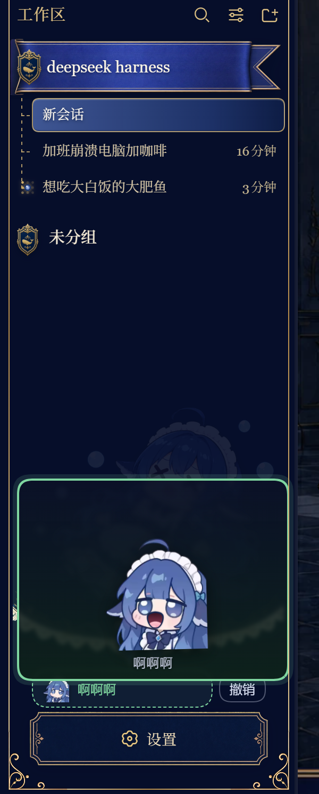
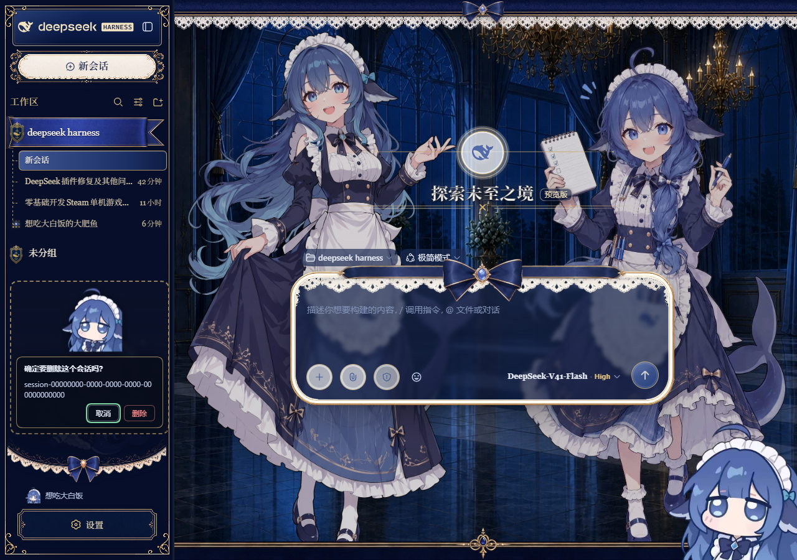
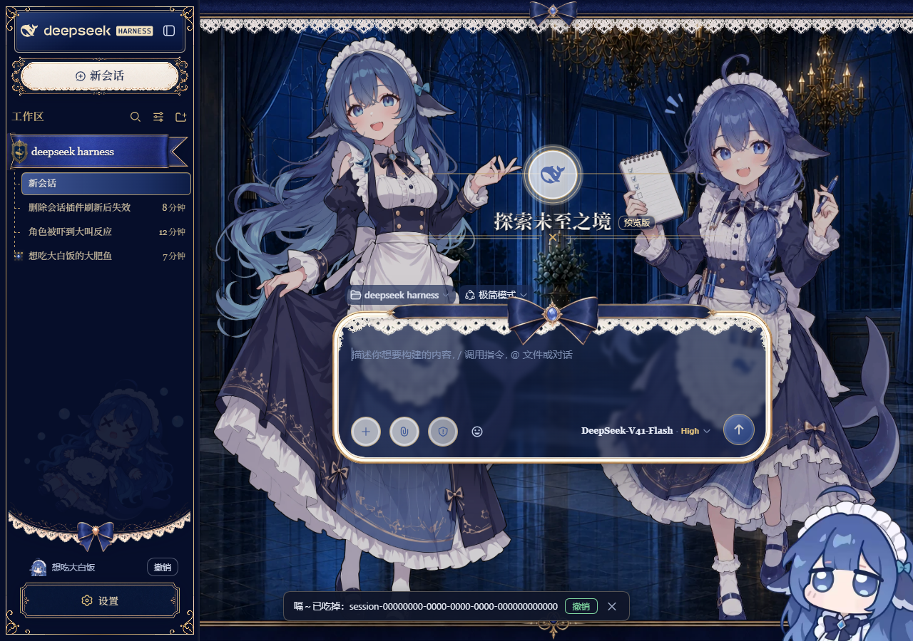
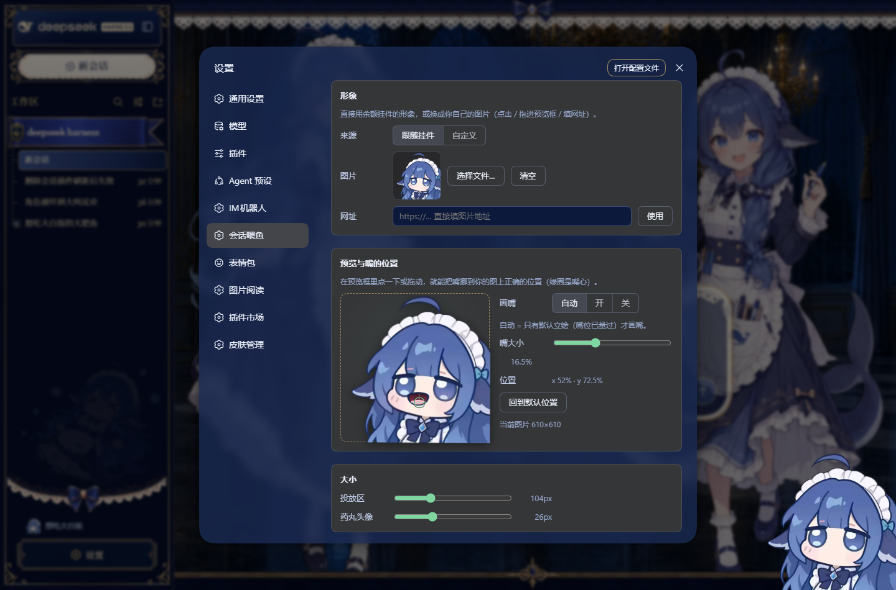
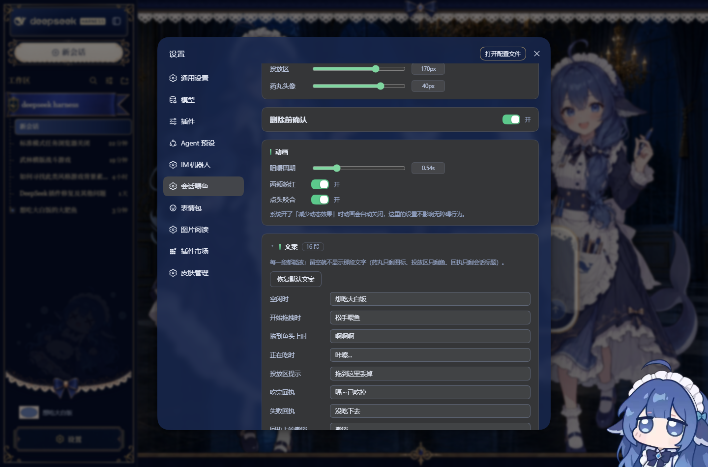
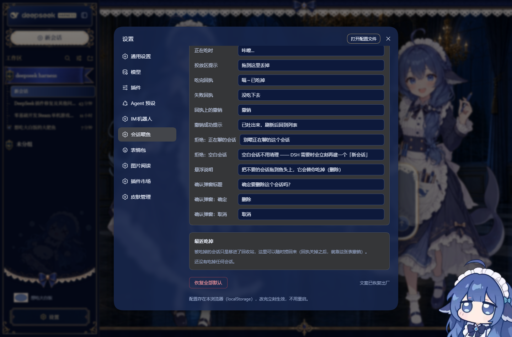

# dsh-session-eater 🐟 会话喂鱼

把不要的会话**拖到侧栏底部的小胖鱼嘴边，它张嘴吃掉** —— 会话目录被送进 **Windows 系统回收站**，能撤销。

> ♻️ **删除 = 进系统回收站。** 会话目录（聊天记录、附件）交给 Windows Shell 送进回收站，
> 所以：**只要回收站里还在，插件里就能撤销**；你在资源管理器里**清空回收站**之后，
> 插件这边也就找不到它了，撤销入口自动消失。
>
> ⚠️ **只有 Windows 上才能撤销** —— 这条桥要 `powershell.exe` 去调 `shell32.dll` 的
> `SHFileOperationW`。别的平台上桥跑不起来，`/delete` 会**直接报错**，不会偷偷改成硬删。

- **删除前确认**：只问一句「消耗了 1.2M token，真的给我吃吗？」，可在设置里关掉
- **撤销两条路**：回执上的「撤销」+ 设置里的「最近吃掉」台账（最多 50 条，跨刷新保留）
- **撤销会把它放回原工作区**：分组视图里直接归位，不用重启 DSH
- **撤销的寿命 = 回收站的寿命**：你清空回收站（或系统自动清理）之后，那些记录**自动从台账里消失**
- **点药丸直达设置**：点侧栏那条药丸（或 Tab + 回车）= 打开「设置 → 会话喂鱼」
- **三只碗**（大白饭 / 蛋炒饭 / 金币）：点哪只端哪只，**拖会话时拖拽幽灵图就变成那只碗**，碗浮在指针上方
- **18 段界面文案全可改**，留空＝不显示；形象、大小、嘴位、动画、被挤时的让位方式也能调
- **吃不了的会当场说清**：空白会话 / 正在聊的 / 正在跑的，就地变红拒绝
- 零运行时依赖、无构建步骤（只有删除/撤销那一下会调一次系统自带的 PowerShell）



---

## 怎么用

1. 侧边栏最底部（「设置」上面）有一条 **🐟 想吃大白饭** 药丸。
   **点它（或按回车/空格）= 直接打开「设置 → 会话喂鱼」**，不用先点设置再找分区。
   文案都能改，见下面的「设置 → 文案」。
2. 抓住任意一条会话行往它那边拖 —— 会话列表下缘会展开一大块虚线投放区（默认写着"拖到这里丢掉"）。
   拖着的时候**指针上跟着一只碗**（不是你选的那条会话的普通快照），碗底压在指针上，像端着一碗饭。
3. 拖到鱼头上：**它张开嘴开始啃**（投放区变绿实线，文案变"啊啊啊"）。
4. 松手 —— **先在会话列表里问一句**，只问一句：不列会话名、也不算轮数账：

   

   ```
   消耗了 1.2M token，真的给我吃吗？
                              [取消] [删除]
   ```

   确认期间鱼**张着嘴不动、脑袋慢慢点、腮红亮着** —— 一副"快给我吃"的渴望表情
   （跟悬停时那种咀嚼 `dse-chew` 明确区分：这里是静止张开）。

   点**删除**才真吃掉（列表里那一行立刻消失，底部弹出「嗝～已吃掉：<标题> ［撤销］」）；
   点**取消**或按 `Esc` 就当什么都没发生，一个请求都不发。默认焦点在**取消**上，回车不会误删。

   > token 数来自**内核自己的会话投影缓存**（`storages/session_projcache/sessions/<id>.json`
   > 里的 `tokenUsage.totals`），跟界面同源，不用解那个 5MB 的多帧 zstd。
   > 读不到时（比如空白会话）会退回不带数字的「真的给我吃吗？」。
   > 这一路**只读内核的盘上文件**，不读任何其他插件的状态、也不调用它们的接口 ——
   > 所以别人装了哪些插件都不影响这里的数字（读不到就退回不带数字的询问语）。

   > 嫌每次都要确认，可以在 **设置 → 删除前确认** 里把开关关掉 —— 那就回到"松手即删"。
   > 关掉之后没有二次确认，**但东西还是会进回收站**，仍然可以撤销。
   > 四段文案（两条询问语、确定、取消）都能改；带用量那条里的 `{tokens}` 会被换成实际数字，
   > 留空则退回不带数字的那条。

> 上面引号里的都是**出厂文案**，全部可以在设置里改掉或清空（清空 = 那段文字不显示）。

### 删掉之后，数据去哪了？

**进了 Windows 系统回收站。** 这就是"能在插件里撤销"的全部原因：

| 东西 | 结果 |
|---|---|
| `%DSH_HOME%\sessions\<分桶>\<sessionId>\`（聊天记录、附件） | 送进 **系统回收站**（`SHFileOperationW` + `FOF_ALLOWUNDO`） |
| 工作区账目里的这条会话 | 摘除 |
| 归档集合里的这条会话 | 摘除 |
| `storages\session_projcache\sessions\<id>.json`（token 统计/排序缓存） | 也进回收站（撤销时一并回来） |

于是有两条路找回它：

1. **插件里撤销** —— 回执上的「撤销」，或 设置 →「最近吃掉」里那条的「撤销」。
   插件查回收站的说明文件（`$I…`）拿到**删除前的原始路径**，把内容搬回去（连原来的分桶都还原），
   **并把会话重新挂回它原来的工作区**（见下）。
2. **资源管理器里还原** —— 打开回收站，选中那几项（会话目录 + 一份 `.json` 缓存）、右键「还原」，
   它们同样回到原位，刷新 DSH 即可。



> 注意这两条路的区别：**插件撤销会把会话挂回原工作区**（分组视图里立刻归位）；
> 在资源管理器里手工还原只把文件放回去，工作区归属要等 DSH 重启后重新扫描才会恢复。

### 撤销之后，它会回到原来的工作区

只把目录搬回来是不够的：删除时插件调了 `detachSession`，已经把这个 id 从工作区账目里划掉了。
不挂回去的话，会话在「按工作区分组」的视图里**没有归属**（只有单列表能看到它）。

所以撤销的第二步是把它挂回去：

- 走内核的 `workspace.attachSession(id)` —— 它会读会话头部、拿 `cwd` 跟工作区路径比对，
  **不匹配就抛错**，所以插件可以放心地"先试首选、再逐个试"，试错没有副作用；
- 首选是**删除时响应里回报的 `workspaceId`**（客户端记进台账、撤销时回传）；
  **它丢了或记错了也不要紧** —— 兜底会按会话目录所在的分桶去匹配工作区路径；
- 原工作区已经被删掉时，撤销**仍然成功**（目录回来了），只是回报 `attached: false`，
  界面不会谎称"已挂回原工作区"。

> ⚠️ **清空回收站 = 真没了。** 在资源管理器里清空之后，插件就查不到那些条目：
> 打开设置页（或点「刷新回收站状态」）时，**这些条目会直接从「最近吃掉」里消失** ——
> 留着也没用，反而让人以为还能撤。如果正好在清空后点了撤销，宿主返回 410 如实告诉你原因。
> 此时文件已经不在磁盘上，任何插件功能都救不回来。
>
> 这里有个刻意的保守设计：**只有在"确实查过回收站"（`checked:true`）时才清记录**。
> 如果 PowerShell 桥没跑起来、查不了，插件什么都不动 —— 免得一次查询失败就把你的记录全清了。

### 会被拒绝的三种情况

拒绝是**就地**给出的，不靠屏幕底部那条容易被忽略的回执：

- 拖到鱼头上**还没松手**，投放区就变红、那行字直接写出原因（「别喂正在聊的这个会话」），
  同时鱼**闭着嘴**（不摆出要吃的张嘴样子）。
- **松手**时整块晃两下、停在红色状态约 1.8 秒，底部再补一条回执（双通道）。

具体哪三种：

- **空白会话**（列表里的「新会话」，没有任何用户消息）：DSH 会为工作区**按需保持**一个空白会话，
  所以把空白的「新会话」喂掉之后，刷新/新建时它会以**新的 session id** 再冒出来 ——
  看起来就像"删了没生效"。插件现在直接拒绝并说明原因。
- **正在聊的这个会话**：客户端拦下，写明「别喂正在聊的这个会话」。
- **正在跑的会话**：宿主还握着它的写句柄，返回 409；客户端认出这个原因码后**也走上面同一套就地拒绝**
  （红色投放区 + 「会话还在跑，先停下来再喂」+ 鱼闭嘴摇头，1.8 秒后自动归位），
  不再落进「没吃下去」那种"像是插件坏了"的失败回执。

> 这三条文案都能在 设置 → 文案 里改（`拒绝：空白会话` / `拒绝：正在聊的会话` / `拒绝：正在跑的会话`），
> 关掉确认弹窗也不影响它们的醒目程度。

> 换句话说：**真正有内容的对话删掉后要靠回收站找回来**（插件不硬删任何东西）。
> 刷新后又看到的那个「新会话」，是一个新 id 的空白会话，不是被删的那条。
> 想确认的话跑 `node tests/inspect-sessions.mjs`，它会按帧解开日志告诉你每条会话有几条用户消息。

---

## 设置：设置 → 会话喂鱼

> 💡 快捷入口：**点侧栏底部那条药丸（或按回车/空格）直接跳到这一页。**
>
> 正路是 **0.14.1 才做对的那条**：设置面板的开合状态（`open` / `activeId`）其实是
> `@deepseek-ai/dsh-client-ui-settings-general` 自己的一个 **store**，而它**挂在槽位注册上** ——
> `ctx.slots.register({ name: "sidebar.settings", store: shellStore, … })`。
> `ctx.slots.entries("sidebar.settings")` 返回的是**原始 entry**（没被投影过），`store` 就摆在顶层，
> 于是插件侧能直接拿到渲染器正在用的那个实例，一句
> `store.create().actions.openSection(NS)` **同时**把面板展开、把分区切到我们这页 ——
> 不碰任何 DOM、也不等面板懒挂载。
>
> DOM 那条路只当**兜底**（store 拿不到时）：先点 `[data-slot='sidebar.settings']` 里的
> `button[aria-haspopup='dialog']`（稳定契约），等面板挂载后点导航项；
> `requestAnimationFrame` 逐帧重试、**超时 3.6 秒**，期间每秒补点一次触发器（只在面板确实没开时才补，
> 开着还点等于把它关掉）。导航项按文案等于 `会话喂鱼` 匹配，另有「喂鱼 / 大白饭 / 吃会话」关键词兜底。
> **刻意不绑类名** —— 构建产物的类名是哈希的（实测 `VOzbGW_trigger` / `VOzbGW_navCell`），
> 客户端一升级就全变。
>
> 整个过程写进 `openSettingsTrace`，卡在哪一步直接能在控制台看：
> `__dshSessionEater.openSettings()`（读上一次的 trace，`via` 是 `store` 还是 `dom`、
> `storeNote` 是 `no-ctx` / `no-api` / `no-entry` / `error`），想手动再跑一遍就用
> `__dshSessionEater.tryOpenSettings()`。



- **形象**：`跟随挂件`（用余额挂件当前的角色图）或 `自定义`。自定义可以**选择文件 / 直接把图拖进预览框 / 填图片网址**，
  挑完自动切到自定义模式，不用先切模式再挑图。上传的图会**等比缩到 ≤512px 再编码成 WebP**，免得撑爆本地存储。
- **预览与嘴的位置**：预览框里显示的嘴就是最终效果，**点一下或拖动就能把嘴挪到你的图上正确的位置**（绿圈是嘴心）。
  `画嘴` 三档：`自动`（只有默认立绘才画，因为只有它量过）、`开`（一直画，自定义图用它）、`关`（不画）。
  还有 `嘴大小`（4%–40%，改宽度时高度按 0.85 倍跟着走）与 `回到默认位置`，底下会显示当前图片的原始像素尺寸。
- **大小**：投放区形象边长（56–220px）、底部药丸头像边长（16–48px）。
- **大白饭**（总开关 + 三只碗）：
  - 标题右边那个开关是**拖拽变碗的总开关**（默认开）。开着时，一开始拖会话那个会话就"变成"一碗饭：
    跟着指针走的是这只碗，侧栏药丸的头像也一起换成碗；关掉就回到原样。
  - **端上来的是**：三个缩略图 —— `大白饭` / `蛋炒饭` / `金币`，点哪只端哪只。
    三张图**全部以 base64 内联在 `lib/client.js` 里**（这就是这个文件 2.6 MB 的原因），
    所以选完**立刻生效**、不依赖宿主路由、也不用重启；宿主那三条 `/rice-bowl*.png` 路由只是兜底。
  - **碗的大小**：48–320px，默认 **128px**。拖拽时那只幽灵碗按同一尺寸画（高 = 宽 × 396/512），
    `setDragImage` 的锚点取在碗底（`h × 0.9`），所以是**碗浮在指针上方、碗底压着指针**。
- **位置**（被挤时的让位）：
  - **被挤到时**：`挪到下面`（默认，给那一行打开 `flex-wrap`）/ `挪到上面`（`wrap-reverse`）/ `就挤着`（不换行）。
  - **让位之后**：`铺满（卡片）`（默认）/ `靠左` / `居中` / `靠右`。
  - **药丸与旁边的间距**：0–200px，默认 10px（`footerActions` 自己没有 gap，得我们自己留横向间距）。
  - **让位后的上边距**：0–20px，默认 2px。
  - 为什么需要这些：侧栏底部那个席位（`sidebar.footer.action`）是官方渲染的**横向一行、且不换行**，
    而余额挂件 `@kenz1117/dsh-ui-usage-billing`（order -10）就排在本药丸左边、同一行里，
    它的盒子写死了 `flex:auto;width:100%;min-width:96px` —— **只要同行，它就会把整行宽度吃掉、
    把药丸压成几十像素的小胶囊**。flex 的换行只能由容器决定，插件没法从子元素那边要求换行，
    所以插件会**测出自己被挤**（比较自己和同行邻居的矩形）之后，给那一行加一个 `dse-footer-row` class
    （随组件卸载摘掉，不留痕），由本插件样式表提供 `flex-wrap`，整块让位到自己那一行。
  - **只有那一行真的只剩自己**时（`wrapped || 同行没有别的挂件`）才拉满宽度变成**卡片**；
    还跟别人挤在同一行时会自动退回紧凑形态，不去挤邻居。卡片的底色/描边/悬停色是**运行时从侧栏
    实际背景色采样**出来的（从这一行往上最多 8 层找第一个不透明背景，优先 `alpha ≥ 0.95`），
    写成 `--dse-surface` / `--dse-tone`，再用 `color-mix(in srgb, …)` 推导出来 —— 所以跟随主题；
    采样不到（主题铺的是半透明玻璃层）就退回 DSH 自己的侧栏底色变量。
- **删除前确认**：一个开关（开着＝松手先弹确认框；关掉＝松手即删），外加**两个颜色**：
  - **文字颜色** / **背景颜色**：确认弹窗那句话的字色与整块卡片的底色，
    下面有**实时预览**（直接用当前两个颜色渲染一句询问语），配成看不清的话一眼就能发现；
    旁边有「恢复默认颜色」。
  - 默认是一对**深底 + 浅字**（`rgba(8,12,24,.92)` + `#e7ebf5`），**不跟随主题** ——
    弹窗底色是深色，而主题的字色在浅色主题下是深色，跟随主题会变成"深字配深底、完全看不清"。
    想跟随主题仍可以点「跟随主题」（高级选项），但请自己确认预览里读得清。
- **动画**：咀嚼周期（0.2–1.6s，默认 0.54）、两颊粉红开关、点头咬合开关。
- **文案** / **最近吃掉**：这两个区块很长，**默认为折叠状态**，点标题展开（标题右侧会给
  `18 段` / `3 条` 这样的摘要，不展开也知道里面有多少东西）。收起时正文**根本不渲染**，
  所以设置页一眼能看全。展开状态记在配置里，刷新后保持。
- **文案**：界面上出现的每一句话都能改，**留空 = 那段文字不显示**（药丸只剩图标、投放区只剩鱼、
  回执只剩会话标题和按钮）。



18 段可改文案与出厂值：

| 设置里的名字 | 出现位置 | 出厂值 |
| --- | --- | --- |
| 空闲时 | 药丸上的字（平时显示的那个） | `想吃大白饭` |
| 开始拖拽时 | 已经抓起会话、还没到鱼头上 | `松手喂鱼` |
| 拖到鱼头上时 | 同时也是投放区的提示语 | `啊啊啊` |
| 正在吃时 | 松手之后、请求返回之前 | `咔嚓…` |
| 投放区提示 | 还没拖到鱼上时，投放区里的那行字 | `拖到这里丢掉` |
| 吃完回执 | 后面会自动接上会话标题 | `嗝～已吃掉` |
| 失败回执 | 后面会自动接上错误信息 | `没吃下去` |
| 回执上的撤销 | 回执里那个撤销按钮的字；留空则回执上不显示撤销 | `撤销` |
| 撤销成功提示 | 点完撤销之后的回执 | `已吐出来，刷新后回到列表` |
| 撤销失败：已不在回收站 | 清空回收站之后再点撤销时的提示 | `回收站里已经没有它了（可能已被清空）` |
| 拒绝：正在聊的会话 | 拖的正是当前打开的会话时 | `别喂正在聊的这个会话` |
| 拒绝：正在跑的会话 | 宿主还握着它的写句柄时的提示（留空则用宿主返回的原因） | `会话还在跑，先停下来再喂` |
| 拒绝：空白会话 | 拖的是没有内容的「新会话」时 | `空白会话不用清理 —— DSH 需要时会立刻再建一个「新会话」` |
| 悬浮说明 | 鼠标停在药丸上时的小提示（title） | `把不要的会话拖到鱼头上，它会替你吃掉（送进系统回收站，可以撤销）` |
| 确认弹窗标题 | 读不到 token 用量时用这条（弹窗里会列出会话名） | `真的给我吃吗？` |
| 确认弹窗标题（带用量） | 里面的 `{tokens}` 会被换成实际用量；留空或读不到用量时退回上面那条 | `消耗了 {tokens} token，真的给我吃吗？` |
| 确认弹窗：确定 | 真的删掉那个按钮（只是送进系统回收站，还能撤销） | `删除` |
| 确认弹窗：取消 | 算了、不发任何请求那个按钮 | `取消` |

改完**立刻生效**（药丸/投放区会马上换字），不用刷新。旁边的 `恢复默认文案` 只重置文案，
底部那个 `恢复全部默认` 会连形象、嘴位、尺寸、动画一起重置。

- **最近吃掉**：吃掉的会话按时间倒序排在这里，每条给标题、多久之前、和一个「撤销」按钮，
  上面还有「刷新回收站状态」与 `N 条可撤销`。条目**最多 50 条**，超了就丢最旧的。



> 设置页自己在导航里的名字（「会话喂鱼」）**故意不可改** —— 否则把它清空就再也找不到这个设置页了。
> 它连"可改文案"表都不进，直接在槽位注册里用 `label: () => "会话喂鱼"` 给出去。

配置存在 `localStorage["dsh-session-eater/config"]`，台账存在 `localStorage["dsh-session-eater/eaten"]`，
**改完立刻生效、刷新不丢、不用重启**。代价是它只属于这个浏览器 —— 换浏览器/换端口要重设一次。
写入失败（图片太大超配额）时面板底部会给出提示。

---

## 实现要点

会话列表由官方 `@deepseek-ai/dsh-client-ui-workspace` 渲染，会话行**本来就**是
`draggable` 的，而且 `dragstart` 会把 sessionId 写进 `dataTransfer` 的 `text/plain`。
所以这个插件完全不改官方组件：

| 半边 | 干什么 |
| --- | --- |
| `lib/client.js` | 在 `sidebar.footer.action` 席位注册药丸（order 40）；文档级监听 `dragstart/dragend/drop`；拖拽期间在会话列表下缘开一块 `position: fixed` 投放区；悬停时给形象挂上 `data-over` 触发张嘴；松手后 `POST /delete`，并渲染可撤销回执；设置页注册在 `settings.section`（order 24，`label` 是「会话喂鱼」）+ 注入 `slots` / `sessions` |
| `lib/index.js` | 注册 `/dsh-session-eater/{delete,restore,recycle,usage,whale.png,status,ping}` 和三张碗图 `/rice-bowl.png`、`/rice-bowl-fried.png`、`/rice-bowl-coin.png`；把会话送进系统回收站、并支持从回收站捞回来 |

### 为什么自己实现删除

内核 `0.1.5-rc.2` **没有可用的会话删除 RPC**：
`workspace/deleteSession` 与 `workspace/unarchiveSession` 只在
`@deepseek-ai/dsh-api-workspace-controller/lib/typert.host.js` 的 typert 清单里被声明，
宿主侧的 `WorkspaceController` 里并没有对应方法，调用只会失败。

所以 `/delete` 用内核已有的公开能力 + Windows Shell 自己走完：

1. 先看这个会话是不是**正在跑**（`ctx.get('agents').get(id).status === 'running'`）→ 是就抛
   `session-running`，HTTP 409，客户端走就地拒绝那一套；
2. `ctx.workspaceRegistry` 里找到持有该会话的工作区 → `workspace.detachSession(id)`（工作区本身保留）；
3. 若在归档集合里 → `registry.unarchiveSession(id)`（顺带清掉指向已消失会话的陈旧归档项）；
4. 会话目录 + 投影缓存 → **送进 Windows 回收站**（`SHFileOperationW` + `FOF_ALLOWUNDO`）；
   **送不进去会直接报错**（`code: move-failed`）而不是假装成功 ——
   静默失败会让用户以为删掉了、刷新却又出现，这是最糟的失败模式
   （`'not on disk'` 不算失败：空白会话本来就没有目录）；
5. `ctx.emit("api-session/removed", id)` —— 这个事件在 `dsh-api-remotes` 的转发白名单里，
   浏览器侧的 session controller 会据此把该行从会话列表摘掉，**无需刷新**；
   客户端拿到 200 后还会再调一次本地的同款入口（`sessions.handleSessionRemoved`）兜底 ——
   因为如果该会话在宿主进程里还是"活的"，宿主可能继续把它写进 baseline。

### 回收站怎么接的（三条路，实测选了一条）

要"把**整个目录**送进回收站、还能拿回原始路径"，只有 Windows Shell 能做到。逐条试过：

| 路线 | 结果 |
| --- | --- |
| `SHFileOperationW` + `FOF_ALLOWUNDO`（shell32，P/Invoke） | ✅ **采用**。目录整体进回收站，系统自己写说明文件 |
| `Shell.Application` COM：`Namespace(10)` + `InvokeVerb("restore")` | ❌ 本机**找不到目标**；它的 `Path` 属性在"隐藏已知扩展名"时还退化成显示名 —— 完全没用 |
| `$Recycle.Bin` 手工搬 `$I`/`$R` | 只用于**还原**，删除仍交给 Shell |

配套的几个细节：

- **删除要复查**：`SHFileOperation` 会**静默跳过被锁住的条目**，所以桥删完会回头 `Test-Path`
  复查原路径真的没了，还在就抛 `still on disk after SHFileOperation: …`。
- **探测**：回收站每个条目有两份文件 —— `$I…`（说明文件，内含删除前原始路径）和 `$R…`（内容本体）。
  解析 `$I…`（新版格式：长度前缀在偏移 24、正文是偏移 28 起的 UTF-16LE 路径）就能拿回删除前的绝对路径；
  老格式（Win8 及更早）那里读到 0，会被自然跳过。`POST /recycle` 就是靠它回答"还能不能撤销"。
- **还原**：按说明文件里的原始路径 `Move-Item` 搬回去，再删掉那对 `$I`/`$R`。
  同一批候选路径里可能有多个**叶子名相同**的（真实分桶 + `--restored--` 兜底），
  所以桥会**按回收站条目先去重**再动手 —— 否则同一条目会被搬第二次而报"不存在项"（踩过一次）。
- 桥脚本是**内嵌在 `lib/index.js` 里的字符串**，第一次用到时写到 `%TEMP%\dsh-session-eater\recycle.ps1`，
  并且**必须带 UTF-8 BOM** —— Windows PowerShell 5.1 在没有 BOM 时按 ANSI 读 `.ps1`，
  中文注释会被拆坏、报 `MissingEndCurlyBrace`（也踩过一次）。桥和宿主之间走"JSON 文件进、JSON 文件出"
  （路径里可能带引号和空格），因为受限沙箱下直接捕获子进程 stdio 会 `EPERM`。
- `/status` 里的 `bridge` 就是**那个 ps1 在不在**：`false` = 桥还没被懒加载（第一次真删时才写），不是故障。

### 排查工具

```powershell
node tests/inspect-sessions.mjs
```

只读列出现有会话 / 投影缓存 / 工作区账目，并告诉你每条会话有几条用户消息（= 是不是空白会话）。
它按 zstd 魔数**切帧逐帧解压** —— `session.v3.jsonl.zstd` 是多帧追加格式（0.6.0 时在本机量过：
当时那个会话 900+ 帧），而 Node 的 `zstdDecompressSync` 只给第一帧，直接解会误判成"只有 1 个事件"。

浏览器侧还有一个诊断桥：

```js
__dshSessionEater.version                 // 宿主半边版本（问 /status 拿的，不是写死的）
__dshSessionEater.sessionsProbe()         // 当前会话 id、各会话的 blank 标记、快照字段
__dshSessionEater.isBlank('session-xxx')  // 某个会话是不是空白会话
__dshSessionEater.current()
__dshSessionEater.config() / setConfig({ size: 140 }) / resetConfig() / persisted()
__dshSessionEater.lastEaten()             // 台账里现在记着什么
__dshSessionEater.filterStats()           // 「隐藏已吃掉的会话」过滤器状态与错误
__dshSessionEater.hideEaten()             // 手动把台账里还在列表上的那些行摘掉，返回摘了几条
__dshSessionEater.rice()                  // 拖拽变碗的现场：幽灵图尺寸、有没有让位、同行几个挂件、采到的底色
__dshSessionEater.openSettings()          // 点药丸没反应的排查口：读上一次的 trace
__dshSessionEater.tryOpenSettings()       // 手动跑一遍"点药丸 → 开设置"
```

### 形象从哪来

默认想用余额挂件那张角色图（`/dsh-whale/image.png`），所以你在挂件里换了角色，鱼头也跟着换。
但**这条路由不是每个环境都有**（本机实测 `GET /dsh-whale/image.png` = 404，全盘没有任何插件注册它），
以前每次刷新都先破一次图再靠 `onError` 换成内置立绘，用户看到的就是"图标老是掉"。

现在改成：**先在后台试加载一次**（全局只探一次），确认能用才切过去，用不了就一直待在插件自带的
`assets/whale-fallback.png` 上 —— 不会先破图再补。而这张兜底立绘也**内联了 base64**（`WHALE_FALLBACK_DATA`），
所以连它都不会 404。药丸头像那边同理，三级回退（想要的源 → 内置鱼 → 摘掉只留文字），
而且**连败 3 次才摘**：中间任何一次成功都清零 —— 主题切换、侧栏收起/展开、宿主刚启动路由还没热，
都可能让一次 `onError` 打在**还能救**的图上。

### 嘴怎么画的

嘴是**手绘 SVG**，不是贴一个椭圆色块：

- 唇线用原画的描边色 `#16264f`（直接从立绘上取的），口腔是暗梅红渐变，舌头粉色 + 一点白高光，
  整张嘴再加一点 `drop-shadow` 让它"嵌"进脸里而不是浮在脸上；
- 口腔 = 唇线路径绕**偏下的支点**缩 0.84（`translate(50 57) scale(0.84) translate(-50 -57)`）——
  于是上唇天然比下唇厚，和原画线稿一致；
- 外层 SVG 是 `16.5% × 14%` 的扁框且 `preserveAspectRatio="none"`，近似圆的路径会自然摊成横向的"啊"口。

口腔坐标源自对 610×610 原始立绘的实测：嘴心约在 `x 52% / y 72.5%`。
自定义图不是正方形时，`object-fit: contain` 会留边，所以嘴的位置是**先换算到图片实际显示矩形再折算回框内**的
（见 `displayRect()` / `mouthBox()`），否则嘴会飘到黑边上。
**换了自定义角色/图标**时在设置页拖一下就能对准。

### 咀嚼动画

嘴和脑袋**同一时长（0.54s）、同一 easing**，所以读起来是"一口咬下去"而不是两个独立动作：

- 张嘴 = 下颚往下掉（`translateY` 正值 + 纵向拉伸），闭嘴 = 下颚往上收（负值 + 压成一条唇线）；
- 脑袋方向相反 —— 合嘴时低头咬下、张嘴时抬头，形成咬合感；
- 一个周期咬两下；两颊的粉红（原画本来就有腮红，这里只做很轻的加成）跟着同一节奏脉动。

系统开了「减少动态效果」时动画自动关闭，嘴保持在张开状态。

想调动画就 `node tests/filmstrip.mjs 10` —— 它把一整个咀嚼周期按相位冻结成一张
`docs/chew-cycle.png`，好不好看一眼就知道。

想把这段动画**导出来做视频片头/封面**用 `node tests/loop.mjs [帧数]`（默认 18 帧 = 每帧 30ms）：

| 产物 | 说明 |
| --- | --- |
| `docs/chew-loop.gif` | 原速循环 0.54s，**透明背景** |
| `docs/chew-loop-slow.gif` | 3 倍慢 1.62s，做片头更好读 |
| `docs/chew-loop-dark.gif` | 深色底（#0e1322）可直接拖进剪辑软件 |
| `docs/chew-loop.webp` | 8 位 alpha，叠背景不会出 GIF 的锯齿边 |
| `<工作区>/_loop-frames/` | 透明 PNG 序列，剪映/PR/AE 都能吃（不入库） |

它和 `filmstrip.mjs` 同一套手法（拖拽武装 → 用负 `animation-delay` 把动画冻在周期里的
不同相位），区别是逐帧单独截图。两个坑记在这：`omitBackground` **只去掉页面默认白底**，
应用自己的背景层得用 `visibility:hidden` 藏掉；`html`/`body` 自己的 `background` 会直接画在
canvas 上，必须显式设成透明 —— 否则导出的帧全是"看起来透明、其实贴了一层底色"。

---

## 文件

```
dsh-session-eater/
├─ package.json          # dsh.bundle.patch + dsh.client 双半边声明（0.14.1）
├─ cordis.patch.yml      # bundle 层的 loader insert
├─ CHANGELOG.md          # 0.1.0 → 0.14.1 的逐版变化
├─ lib/
│  ├─ index.js           # 宿主半边（路由 + 送/取回收站，内嵌 PowerShell 桥）
│  └─ client.js          # 客户端半边（药丸 + 投放区 + 碗 + 嘴 + 设置页 + 配置存储）
├─ assets/
│  ├─ whale-fallback.png # 默认立绘兜底（另有一份 base64 内联在 client.js 里）
│  ├─ rice-bowl.png      # 大白饭
│  ├─ rice-bowl-fried.png# 蛋炒饭
│  └─ rice-bowl-coin.png # 金币
├─ screenshots.json      # 插件市场展示图清单
├─ tests/                # 只在仓库里（见下面的「仓库现状提醒」）
├─ scripts/              # 同上
└─ docs/                 # 同上；README 里的图都在这里
   ├─ eating.png         # 真实尺寸下的投放区
   ├─ confirm.png        # 删除前确认弹窗
   ├─ toast-undo.png     # 吃掉后的回执
   ├─ settings.png       # 设置页
   ├─ settings-text.png  # 设置页的「文案」区块
   ├─ settings-eaten.png # 设置页的「最近吃掉」区块
   ├─ chew-cycle.png     # 咀嚼周期 10 帧分解
   └─ chew-loop.gif      # 咀嚼循环动图（透明背景；loop.mjs 生成）
```

> `package.json` 的 `files` 白名单只有 `lib`、`assets`、`cordis.patch.yml`、`README.md`、
> `CHANGELOG.md`、`LICENSE` —— 所以 `tests/`、`scripts/`、`docs/` **只存在于 GitHub 仓库里**，
> 装到本机的那份副本没有它们（README 里的截图也只在仓库页面上显示）。
> 生成碗图 base64 的 `build-rice-models.mjs` 和 `INSTALL-NOTES.md` 同样是**本地工作副本里的东西**，
> 仓库里没有收录。

---

## 安装 / 卸载

**方式一：DSH 界面里「添加插件」（推荐）**

在 **DSH Web / 桌面版的插件页点「添加插件」**，把仓库地址粘进输入框即可：

```
https://github.com/mikugui/dsh-session-eater
```

（`github:mikugui/dsh-session-eater` 这种简写也认。）
装完**重启宿主**（`dsh web`；桌面版＝完全退出 DeepSeek Harness 再打开）才生效。
想升级：清掉插件目录里这份、再按同样步骤装一次；或 `dsh plugin --profile web update dsh-session-eater`。

**方式二：命令行**

```powershell
dsh plugin --profile web add github:mikugui/dsh-session-eater
```

**方式三：下载 zip 手动装**

不想让 pnpm 去拉 GitHub 的话，下载 Releases 里的压缩包，解到任意目录，然后：

```powershell
dsh plugin --profile web add "link:D:\path\to\dsh-session-eater"
# 或直接用 tgz
dsh plugin --profile web add "D:\path\to\dsh-session-eater-0.14.1.tgz"
```

> ⚠️ 前两种方式都要靠 **pnpm + 全局可用的 `git`**（GitHub 安装本质是一次 git clone）。
> 如果机器上只装了 GitHub Desktop（它自带的 git 不进 PATH），先补上 PATH 再装，例如：
>
> ```powershell
> $env:PATH += ";$env:LOCALAPPDATA\GitHubDesktop\app-3.6.6\resources\app\git\cmd"
> ```
>
> 或者干脆装个 Git for Windows，或者改用方式三。

整个插件**零运行时依赖**（宿主半边只用 node 内置模块，客户端半边只 require 宿主已提供的
`react` / `react/jsx-runtime`），所以不需要任何额外安装步骤。

### 本机当前的实际装法（bundle 层）

这台机器上**已经装好并且在跑**了，走的是**标准 bundle 层**（`package.json` 的
`dsh.profile.bundles` + pnpm `link:`），profile 是 **`desktop`**（桌面版 Electron 独占这个 profile），
用户 patch 层里**一个 session-eater 字样都没有**：

```jsonc
// %DSH_HOME%\profiles\desktop\package.json
"dependencies": { "dsh-session-eater": "link:C:/Users/gzx/.dsh/plugins/dsh-session-eater" },
"dsh": { "profile": { "bundles": [ "...", "dsh-session-eater" ] } }
```

安装 / 卸载都走 CLI，别手改 YAML：

```powershell
dsh plugin --profile desktop add "link:C:/Users/gzx/.dsh/plugins/dsh-session-eater"
dsh plugin --profile desktop remove dsh-session-eater
```

> ⚠️ **不要同时在用户 patch 层（`profiles\desktop\cordis.patch.yml`）里再 insert 一次。**
> bundle 层和用户 patch 层会各插一遍同一个 id，loader 直接抛
> `duplicate loader entry id: dsh-session-eater` 把 boot 打崩，只能手改 YAML 才救得回来。
> 二选一，且以 bundle 层为准。现在这份 `cordis.patch.yml`（928 B）里**没有**任何 session-eater 注册，
> 名字只出现在 profile `package.json` 的 `dsh.profile.bundles` 里。
>
> ⚠️ **改了宿主侧 `lib/index.js` 必须重启宿主才生效。**
> bundle 层不做热重载；`patchReload: live` 只监听 patch 层文件，不会重新 import 模块。
> 客户端半边（`lib/client.js`）不受影响：`dsh-client-hmr` 在轮询 bundle，改完浏览器
> 会自动热重载。想确认宿主半边的版本，看 `/dsh-session-eater/status` 返回的 `version` 字段。
>
> 🧭 Web profile 上可以用 `dsh web --dump-config > $env:TEMP\dump.yml`，再
> `Select-String ... "^- id: "` 找重复 id；**桌面版上没有这条**（profile 是 `desktop`，
> `dsh --dump-config` 这条命令用不了），桌面版改完依赖直接看日志里的 loader 报错。

---

## 测试与调参工具

这些脚本都对着**正在运行**的宿主说话，不需要重启，也不会碰任何真实对话。
**它们不在安装到本机的那份副本里**（`package.json` 的 `files` 白名单不带 `tests/`），
要跑得先拿到仓库：

```powershell
git clone https://github.com/mikugui/dsh-session-eater
cd dsh-session-eater
node tests/verify-host.mjs      # 合成会话目录 → 验 /delete 契约与"目录真的被删了"
node tests/verify-client.mjs    # 拖拽/张嘴/回执（fetch 打桩）
node tests/verify-settings.mjs  # 设置页：上传图、按 contain 校准嘴位、尺寸、持久化、恢复默认
node tests/inspect-sessions.mjs # 只读取证：会话/缓存/账目（排查"删了又回来"用）
node tests/peek-localstorage.mjs # 只读取证：从 Edge/WebView2 的 LevelDB 读你存的配置
node tests/filmstrip.mjs 10     # 咀嚼周期 10 帧分解 → docs/chew-cycle.png（调动画用）
node tests/hero.mjs             # 重出 README 效果图 → docs/eating.png
```

- 宿主测试：自己造 `session-eater-selftest-*` 目录，验完清理干净。
- 客户端测试：页面里把 `window.fetch` 换成桩，`/dsh-session-eater/*` 只记账不外发，
  所以**物理上不可能**删掉你的会话；拖拽用真 `DragEvent` + `DataTransfer` 合成。
- 设置测试：上传一张**非正方形**图，验证嘴是按要求换算到 `contain` 后的显示矩形而不是正方形框；
  它在一次性的 headless 浏览器里跑，不会动你正在用的浏览器里的配置。

依赖探测顺序：`DSH_TEST_BROWSER` → Edge → Chrome。
puppeteer-core 直接复用 profile 里已有的那份，不额外装东西。

> 📌 **上面这些脚本的实际状态见文末的「仓库现状提醒」** —— `lib/` 是 0.14.1，
> 但 `tests/` / `scripts/` / `docs/` 里的图还停在 0.6.0 那个时代，不一定还能直接跑通。

---

## 维护者：怎么发版

`scripts/` 下有几个脚本，**全程走 GitHub REST API，不依赖 git**
（网络受限、或机器上根本没装 git 时尤其有用）：

```powershell
# 0) 改仓库页面上那句「简介」（Description / topics）：正文写在脚本顶部的 ABOUT 里
node scripts/update-meta.mjs --dry-run      # 只看新旧文案
node scripts/update-meta.mjs                # 真写（幂等）

# 1) 推代码：把当前目录作为一个提交追加到远端 main 之上
node scripts/publish-github.mjs --dry-run   # 先看会推哪些文件
node scripts/publish-github.mjs             # 真推

# 2) 发 Release：打 tag、写 release notes（自动取 CHANGELOG 里对应段落）、上传附件
node scripts/release-github.mjs --dry-run
node scripts/release-github.mjs             # 附件自动找上一层的 *-<version>.tgz / *.zip

# 3) 投稿到插件市场（精选目录 awesome-dsh-plugin：一个 PR 加一个 yml）
node scripts/submit-market.mjs --dry-run    # 离线：打印计划与待提交的 entry 内容
node scripts/submit-market.mjs              # 加 topic + 补无版本号 tarball + fork + 建分支 + 开 PR

# 打包（发 Release 前先做）
npm pack --pack-destination ..
Compress-Archive -Path .\* -DestinationPath ..\dsh-session-eater-<version>.zip
```

**投稿到市场的硬性条件**（CI 会逐项检查）：`package.json` 必须有 `dsh.bundle`
（只有 `dsh.client` 会被拒）、仓库根要有 `cordis.patch.yml`、仓库**创建满 1 天**、仓库带 `dsh-plugin` topic。
`submit-market.mjs` 会先查仓库年龄，不满 1 天直接拒绝提交并告诉你可以提的时间。
`tarball:` 建议指向**不带版本号**的附件（`releases/latest/download/<name>.tgz`）——
带版本号的文件名会在下次发版后 404，脚本会自动补上传这个附件。

**凭据**读取顺序：环境变量 `GITHUB_TOKEN` / `GITHUB_OWNER` → 工作区根目录的 `.github-token`。
后者是两行文本（第 1 行 token，第 2 行用户名可选，`#` 开头是注释），建议存成 **UTF-8 带 BOM**，
这样记事本打开不乱码。脚本会**用正则从整行里抠出令牌本体**，前后多粘了 `ghp_` / `github_` 之类
前缀也能认出来；并会先做形状预检（classic 必须是 `ghp_` + 36 字符）再动网络。

> ⚠️ **令牌请用 classic + 只勾 `repo`**。fine-grained 令牌**建不了仓库**
> （`POST /user/repos` 会回 403 `Resource not accessible by personal access token`）。

**两个实测踩过的坑（脚本已经各自兜住，但值得知道）**

1. **`latest/download/<name>.tgz` 的名字不能立刻复用**。附件名是仓库级唯一的，发新版时脚本会
   把它从旧 Release 上摘下来再传到新 Release —— 但 GitHub 的删除**不是立刻生效**的，
   刚摘完就传会回 `422 already_exists`。现在脚本会带重试（最多 6 次 × 10 秒，每次重试前再摘一遍）。
2. **投稿用的 fork 会过期，而过期的 fork 会让 PR 变 `dirty`**。fork 落后上游之后：
   - 直接拿上游 main 的 sha 在 fork 上建 ref 会 `404 Not Found`（那个提交不在 fork 的对象库里）；
   - 退用 fork 自己的 main 又能建 ref，但那个 base 里**还没有我们的条目文件**，
     于是新分支"新增"了一个上游已存在的文件 → add/add 冲突，PR 合不了。
   脚本会先试 `merge-upstream` 同步 fork；本机这条**必然失败**，因为上游带
   `.github/workflows/build-site.yml`，而 classic 令牌没有 `workflow` 权限
   （`422 refusing to allow a Personal Access Token to create or update workflow`）。
   失败后脚本会退到「**上游最后一次改过本条目文件的提交**」当 base。
   想彻底省掉这个回退，给令牌补一个 `workflow` 勾选即可（**令牌字符串不变，不用重新粘**）。

**发版清单**

1. 改 `package.json` 的 `version`
2. 在 `CHANGELOG.md` 顶部加 `## <version>` 段落（会被自动当作 release notes）
3. `npm pack` + `Compress-Archive` 出两个产物
4. `node scripts/publish-github.mjs`
5. `node scripts/release-github.mjs`
6. 删掉 `.github-token`，并去 GitHub 设置里把这个令牌 **Revoke**

**关于提交历史**：`publish-github.mjs` 是在**远端 head 之上**建提交的，所以它产生的 SHA 和本地
`git commit` 出来的不同（同内容、不同历史）。要么以后统一用脚本推，要么在网络正常时先
`git fetch origin && git reset --hard origin/main` 把本地对齐，再用普通 `git push`。

### 不需要令牌的发版路径（日常推荐）

只要 `git` 能推（凭据交给 Git Credential Manager / GitHub Desktop 管），发版可以完全不碰 API：

```powershell
# 1) 改 package.json 的 version，在 CHANGELOG.md 顶部加 ## <version> 段落
# 2) 打包
npm pack --pack-destination ..
Compress-Archive -Path .\* -DestinationPath ..\dsh-session-eater-<version>.zip
# 3) 提交与 tag 一起推
git add -A
git commit -m "release: v<version>"
git tag -a v<version> -m "dsh-session-eater v<version>"
git push --follow-tags
```

4. 网页上发 Release：仓库页右侧 **Releases → Draft a new release** → 选刚推上去的 tag
   → 正文粘 `CHANGELOG.md` 里那段 → 把上面两个产物拖进附件区 → **Publish release**。

两个脚本的 `--dry-run` 都是**纯离线**的（不校验凭据、不发网络请求），可以先用它确认
要推 / 要传哪些文件。`release-github.mjs --dry-run` 还会顺便打印它准备用的 release notes。

> **网络提醒（在受限网络里实测得到）**：`github.com:443` 会**时通时断** ——
> 同一台机器上出现过 `git push` / `curl` 连续 21 秒超时（`Failed to connect to github.com
> port 443`），而 `api.github.com` 全程稳定。所以在这种环境里**优先用上面那两个 API 脚本**，
> `git push` 只作为网络窗口好时的补充。判断方法很直接：
>
> ```powershell
> curl.exe -4 -s -o NUL -w "%{http_code}`n" -m 20 https://github.com/     # 000 = 不通
> Invoke-RestMethod https://api.github.com/rate_limit                    # 有响应 = 通
> ```

---

## 排障：删不掉 / 拖了没反应 / 界面样式裸奔

按这个顺序查，绝大多数情况第 1 步就好了：

1. **先刷新页面（F5）。** 客户端半边由 `dsh-client-hmr` 热重载，**宿主半边改动要重启宿主**
   （`dsh web`，桌面版是**完全退出 DeepSeek Harness 再打开**）。
   如果你在重启前就开着页面，标签页里跑的可能还是旧 bundle —— 现象正是"拖进去没反应、
   会话删不掉"（请求根本没发出去）。

   > ⚠️ 从旧版升级上来时尤其注意：**宿主半边的删除语义变过三次**
   > （`rename` 进插件自己的目录 → `rm -rf` 硬删 → 现在是**送进 Windows 系统回收站**）。
   > 光刷新页面只换客户端，旧宿主进程仍在跑老代码 —— 现象就是"删了之后插件里撤不回来"。
   > 改完**重启一次宿主**。

   **同一个根因还会让界面"裸奔"**：插件注入的 `<style>` 是挂在 `ctx.effect` 的清理函数上的，
   热重载时会被摘掉；如果那次重载没跑完，页面就一直没样式 —— 于是布局退回默认的块级流淌。
   实测过别人的插件栽在这：表情包选择面板从 **4 列网格** 变成 **774×1800 的一列竖排**
   （`.mp-grid` 的 `display` 从 `flex` 变回 `block`），刷新即恢复。本插件已经加了**样式自愈**
   （`MutationObserver` 盯 `<head>`，样式不在就补一次），所以不刷也应该没事，但别的插件不一定有。
2. **看宿主半边活着没：**

   ```powershell
   curl http://127.0.0.1:3080/dsh-session-eater/status
   ```

   正常会返回这一串字段：

   ```json
   {"ok":true,"plugin":"dsh-session-eater","version":"0.14.1",
    "home":"C:\\Users\\gzx\\.dsh",
    "sessionsRoot":"C:\\Users\\gzx\\.dsh\\sessions",
    "permanent":false,"recycleBin":"windows","bridge":true,
    "fallbackImage":true,
    "bowls":{"rice-bowl.png":true,"rice-bowl-fried.png":true,"rice-bowl-coin.png":true}}
   ```

   各管一件事：`permanent:false` = 不是硬删；`recycleBin:"windows"` = 走系统回收站；
   `bridge:true` = PowerShell 桥脚本**已经**写到 `%TEMP%\dsh-session-eater\recycle.ps1`
   （`false` 只是说明还没被懒加载，第一次真删时才写，不是故障）；
   `fallbackImage` = 兜底立绘在不在；`bowls` = 三只碗在不在磁盘上。
   `version` 直接读自 `package.json`，所以"装的到底是哪一版"一眼能看出来，不会骗人。
   `home` / `sessionsRoot` 用来确认 DSH_HOME 解析对了（`%DSH_HOME%` 优先，否则 `~\.dsh`）；
   找不到路由也不一定是你错了 —— 端口按你实际在用的那个来，Web 模式默认是 3080。
3. **看日志有没有 loader 报错**（`%TEMP%\dsh-web.log`）：
   - `duplicate loader entry id: dsh-session-eater`
     → 插件被注册了**两次**。它只能出现在**一处**：profile `package.json` 的
     `dsh.profile.bundles`，**或者** profile `cordis.patch.yml` 里的 `insert:`，不能两边都写。
     （插件管理器每次装/卸插件都会按 dependencies 重组 bundles，很容易把两边都写上。）
   - 其它 `plugin tree failed to load` → 先修 patch / bundles，再重启。

删除失败时回执会带原因（例如「没吃下去：HTTP 404」，或宿主返回的
`session not found` / `move-failed`），把那一行贴出来就能定位。

撤销失败时也会带原因：**回收站被清空**的话是 **410 + `not-in-recycle-bin`**，
界面会显示「回收站里已经没有它了（可能已被清空）」，并把那条台账标成不可撤销。
不是 Windows 上跑的话，宿主会直接告诉你桥起不来（不会静默改成硬删）。

---

## 仓库现状提醒

`lib/` 是从 0.6.0 的写法**一次性跳到 0.14.1** 的，而仓库里其它东西没跟着走：

- `tests/` 里那 11 个 `.mjs` 脚本（外加 `tests/fixtures/`）还是老代码那套假设 ——
  写它们的时候删除还是"rename 进插件自己的回收站"，还没有系统回收站、没有 `/recycle`、
  没有三只碗、没有让位逻辑。`CHANGELOG.md` 里 0.11.0 到 0.14.1 的条目**没有一条提到过测试脚本的改动**，
  所以**不一定还能直接跑通** —— 跑之前请把它们当参考，而不是当这个版本的回归测试。
- `scripts/` 也是同一批（`update-meta.mjs` / `publish-github.mjs` / `release-github.mjs` /
  `submit-market.mjs` / `market-entry.yml`），同样没有随 0.14.x 更新过；
  「维护者」那一节写的流程本身还是照它们来的。
- `docs/` 里的截图（`eating.png` / `confirm.png` / `toast-undo.png` / `settings.png` /
  `settings-text.png` / `settings-eaten.png`）是**0.6.0 的界面**：没有三只碗、没有「位置」分区、
  也没有 0.14 的卡片形态。图片先留着没重出，但**别把它们当成 0.14.1 的样子**。

要判断某一句话是不是过时，以这三处为准：`lib/index.js`、`lib/client.js`、`CHANGELOG.md`。
（`tests/`、`scripts/`、`docs/` 都不进安装包 —— 见「文件」一节里 `files` 白名单的说明。）

---

## 已知取舍

- 只处理**左侧会话列表**里的常规会话行；工作区行（`projectRow`）拖不动，也不会被吃。
- 空白会话（还没落盘的）也能吃：磁盘上没有目录时就只摘账目 + 广播移除。
- **只在 Windows 上能撤销** —— 撤销依赖 Windows 回收站（`SHFileOperationW` + 解析 `$I` 说明文件）。
  非 Windows 平台上这条桥跑不起来，`/delete` 会直接报错而不是偷偷改成硬删。
- **撤销的寿命 = 回收站的寿命**：用户清空回收站、或系统自动清理（回收站有配额，超了会删最旧的）
  之后，那些条目就撤不回来了。插件不做第二份备份，这是刻意的；
  这时「最近吃掉」里的对应记录也会被清掉（只在确认查过回收站之后才清）。
- **台账只记 sessionId / 标题 / 时间 / 工作区 id**：挂在浏览器 localStorage，最多 50 条。
  `workspaceId` 用来在撤销时把会话挂回原工作区；**内核才是工作区归属的权威** ——
  插件只是在"删除时记一笔、撤销时还回去"，不自己维护一份工作区名单。
- **升级前留下的旧回收站不会自动清**：0.7.0 之前更早的版本把目录挪进
  `%DSH_HOME%\session-eater-trash`（插件自己的目录，不是系统回收站），里面的东西还躺在磁盘上。
  想找回就手动搬回 `%DSH_HOME%\sessions\<原分桶>\<sessionId>\`；不要了就整个目录删掉。
- **配置只存在本浏览器**（localStorage），不跨浏览器/端口同步 —— 想跨端同步得把配置搬到宿主侧
  （新增宿主路由 + 落盘），而宿主代码改动需要重启宿主才生效，所以这版先做客户端持久化。
- 自定义图标建议用**透明背景 PNG**（嘴是画在图片上的，不透明底的方图会看出边界）。
